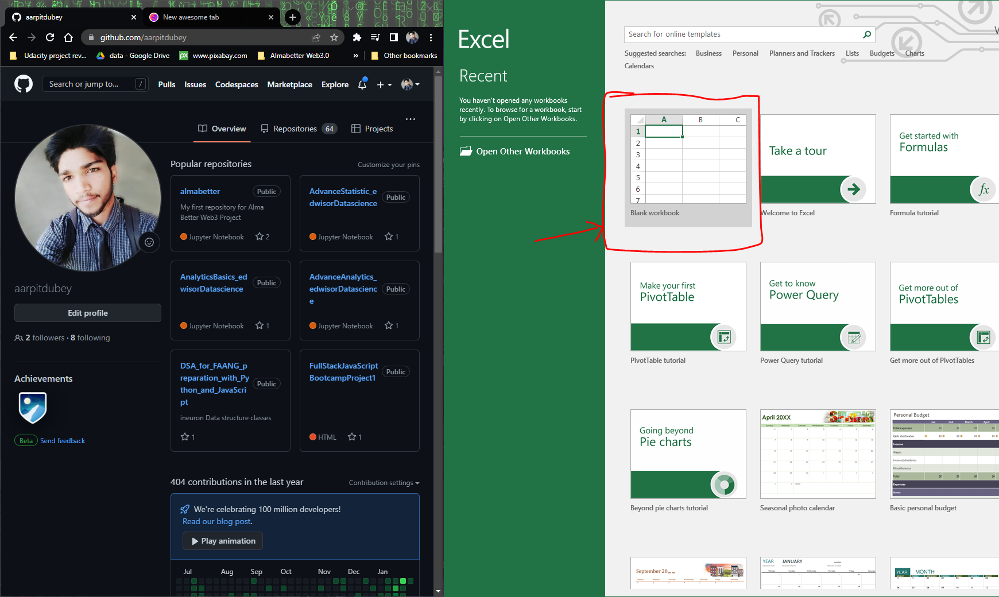
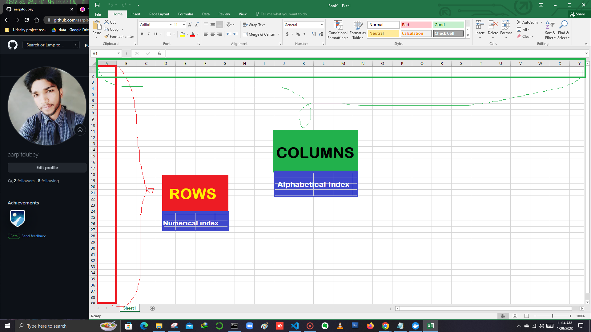
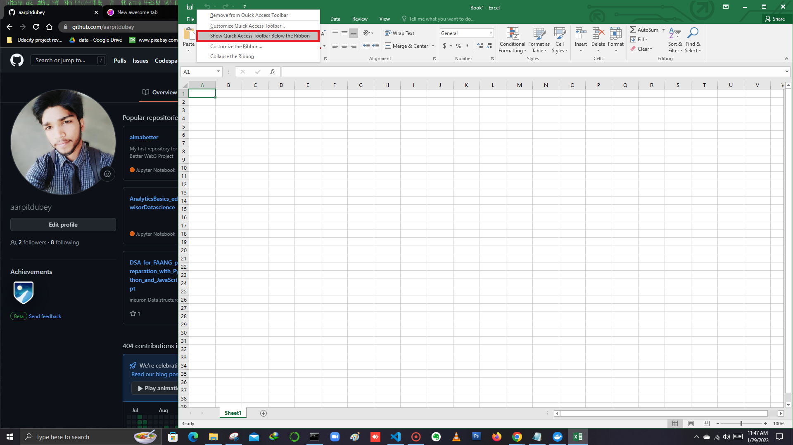

# Advance Excel

1. Open MS Excel and click on Blank workbook.

2. You will see many **Numerical indices given vertically** and **horizontally there are Alphabetical indices given**. 

- Vertically given Numerical indices are **ROWS**.
- Horizontaly given Alphabetical indices are **COLUMNS**.

3. **Quick Access Toolbar :** If you use an Excel command frequently, you can add it to the Quick Access Toolbar. By default, the Quick Access Toolbar contains four commands: **AutoSave, Save, Undo and Redo**

## To add a command to the Quick Access Toolbar, execute the following steps:

- Right click the command, and then click Add to Quick Access Toolbar.

